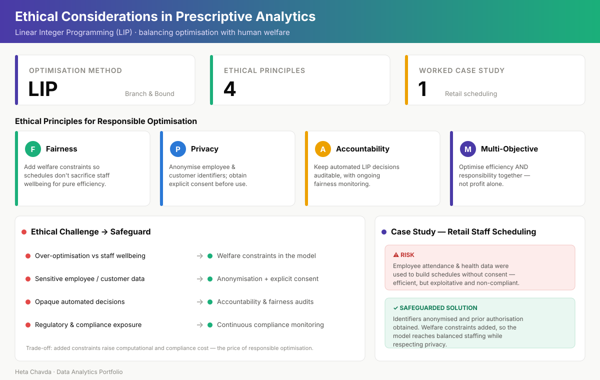

<div align="center">



# ⚖️🤖 Ethical Considerations in Prescriptive Analytics
### Optimising Responsibly with Linear Integer Programming (LIP)


</div>

---

## 📌 Project at a Glance

| | |
|---|---|
| **🎯 Goal** | Examine the ethical challenges of automated decisions made with prescriptive analytics |
| **🧠 Approach** | Frame Linear Integer Programming (LIP) risks and propose concrete safeguards |
| **📊 Focus** | Over-optimisation & data privacy in optimisation models, via a worked case study |
| **📈 Delivery** | Presentation deck + Excel LIP examples |

---

## 🧩 Business Problem / Context

Prescriptive analytics doesn't just describe or predict — it **decides**. **Linear Integer Programming (LIP)**, solved efficiently with the **Branch & Bound** algorithm, automates choices under integer constraints across retail, manufacturing, and healthcare.

> **The tension:** *A model tuned purely for efficiency or profit can quietly harm the people it schedules, prices, or serves.*

This project asks how to keep powerful optimisation **fair, private, and accountable** — so automation builds trust rather than liability.

---

## 🗂️ Scope / Data

| Element | Detail |
|---|---|
| ⚙️ **Technique** | Linear Integer Programming (LIP), solved via Branch & Bound |
| 🏬 **Domains** | Retail, manufacturing, healthcare decision automation |
| ⚠️ **Core risks** | Over-optimisation (profit over wellbeing); misuse of sensitive data |
| 🧪 **Worked example** | Retail staff-scheduling scenario with Excel LIP calculations |

---

## 🔬 Methodology / Framework

```
RESPONSIBLE OPTIMISATION WORKFLOW
──────────────────────────────────────────────
1. Model the decision as an LIP problem
2. Identify where pure optimisation causes harm
       ├─ Over-optimisation → staff wellbeing
       └─ Data misuse       → privacy breach
3. Inject ethical safeguards:
       • Welfare constraints          (fairness)
       • Anonymisation + consent      (privacy)
       • Audit trails + monitoring    (accountability)
       • Multi-objective formulation  (balance)
4. Re-solve → balanced, compliant decision
5. Weigh trade-off: added compute & compliance cost
──────────────────────────────────────────────
```

---

## 📊 Ethics & Safeguards Dashboard

<div align="center">



*Four ethical principles, a challenge-to-safeguard map, and the retail-scheduling case study. The case narrative is illustrative of the scenario presented (representative — no exact metrics claimed).*

</div>

---

## 📈 Key Insights

- ⚙️ **Over-optimisation is the central risk** — models chasing efficiency or profit can neglect employee wellbeing.
- 🔒 **Data privacy is easily compromised** — sensitive employee and customer data may be used without proper safeguards.
- 🟢 **Welfare constraints restore fairness** — encoding wellbeing directly into the model prevents exploitative outcomes.
- 🔵 **Anonymisation + consent protect privacy** — without blocking the optimisation itself.
- 🟣 **Multi-objective optimisation balances** efficiency and responsibility, rather than optimising profit alone.
- 💡 **Ethics is a business advantage** — safeguards reduce legal liability, build trust, and support long-term sustainability, at the cost of added computational and compliance overhead.

---

## 💼 Impact / Takeaways

| Stakeholder | Benefit of ethical safeguards |
|---|---|
| 👷 **Employees** | Protected from exploitative, efficiency-only scheduling |
| 🤝 **Customers** | Data handled with consent and anonymisation |
| 🏢 **Business** | Lower legal liability, stronger brand & stakeholder trust |
| 📉 **Trade-off** | Added constraints raise computation and compliance cost |

---

## 🛠️ Tools & Techniques

| Category | Tools |
|---|---|
| **Optimisation** | Linear Integer Programming (LIP), Branch & Bound |
| **Analysis** | Microsoft Excel (LIP examples & calculations) |
| **Concepts** | Multi-objective optimisation, data anonymisation, welfare constraints |
| **Deliverable** | Presentation deck + supporting spreadsheet |

---

## 📁 Repository Contents

```
Ethical Considerations in Prescriptive Analytics/
├── 📁 assets/
│   ├── 🎨 banner.svg                    # Repository banner
│   └── 📊 dashboard.svg                 # Prescriptive analytics dashboard
├── 📁 data/
│   └── 📊 Integer Linear Programming.xlsx   # ILP examples & calculations
├── 📁 docs/
│   └── 📄 Final Presentation.pptx        # Challenges, safeguards & case study
└── 📝 README.md                         # Project overview
```

---

<div align="center">

**Heta Chavda** — Data Analytics | Optimisation | Data Ethics

*Group presentation with Krishna Patel, Pavan Naik & Jayram Karan*

[](https://github.com/hetachavda)
[](https://linkedin.com/in/hetachavda)

⭐ *Found this useful? Give it a star!*

</div>
